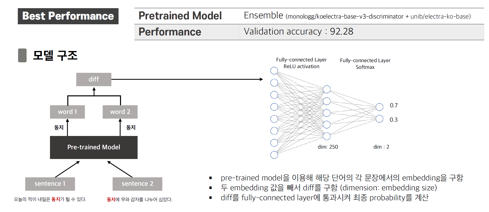
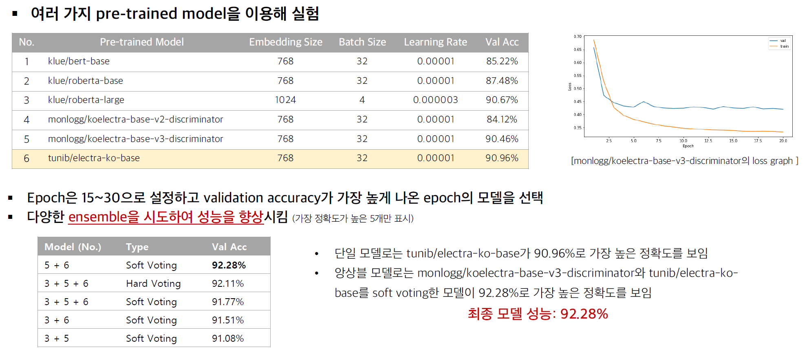

# NLP_NIKL-competition

### 2021 국립국어원 인공 지능 언어 능력 평가 [[링크]](https://corpus.korean.go.kr/task/taskList.do?taskId=1&clCd=END_TASK&subMenuId=sub01)
### 모델 성능 평가 모드 [[링크]](https://docs.google.com/spreadsheets/d/1-uenfp5GolpY2Gf0TsFbODvj585IIiFKp9fvYxcfgkY/edit#gid=0)

## 요약
| 과제명 | 내용 | 조원 | 성능 | 지표 |
| ----------- | ----------- | ----------- | ----------- | ----------- |
| 문장 문법성 판단 (COLA) | 문법에 맞는 문장과 문법에 맞지 않은 문장을 구분하는가 | 김상엽 | 57.73 | Matthew's Correlation Coeffienct |
| 동형이의어 구별 (WiC) | 형태가 같고 의미가 다른 단어의 의미를 구별하는가 | 김현종 | 92.28 | Accuracy |
| 인과 관계 추론 (COPA) | 주어진 문장의 원인 또는 결과를 적절하게 추론하는가 | 박소형 | 89.40 | Accuracy |
| 판정 의문문 (BoolQ) | 제시문을 읽고 질문에 '예, 아니오'로 답변할 수 있는가 | 배지현 | 85.57 | Accuracy |

## 동형이의어 구별

  

  

## References (동형이의어 구별)
- https://github.com/llightts/CSI5138_Project
- https://github.com/kamo9298/NLP-Group-Project-WiC
- https://github.com/NIKL-Team-BC/NIKL-KLUE
